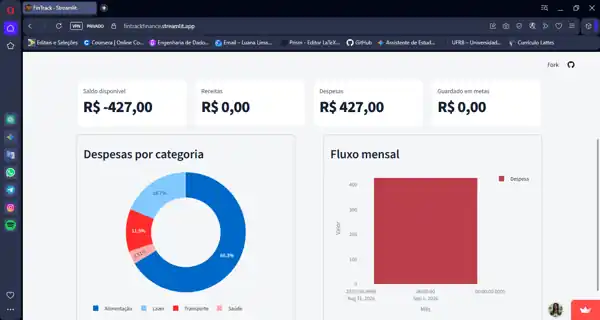
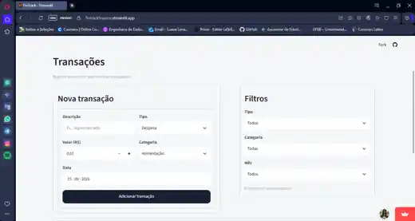
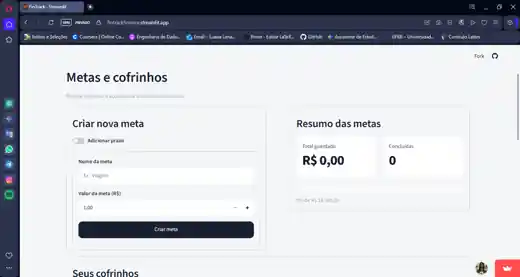

# FinTrack

<p align="center">
  
</p>

<p align="center">
  <strong>Controle financeiro pessoal online, responsivo e com dados sincronizados.</strong>
</p>

<p align="center">
  <a href="https://fintrackfinance.streamlit.app/">Abrir aplicação</a>
  ·
  <a href="#funcionalidades">Funcionalidades</a>
  ·
  <a href="#tecnologias">Tecnologias</a>
  ·
  <a href="#como-executar-localmente">Executar localmente</a>
</p>

---

## Sobre o projeto

**FinTrack** é uma aplicação web de finanças pessoais desenvolvida em Python. O sistema permite registrar receitas e despesas, acompanhar indicadores financeiros, visualizar gráficos e criar metas de economia por meio de cofrinhos.

A aplicação utiliza autenticação de usuários e banco de dados online, permitindo acessar os mesmos dados pelo computador, celular ou tablet.

### Demo online

**https://fintrackfinance.streamlit.app/**

> O aplicativo está hospedado no Streamlit Community Cloud e utiliza Supabase para autenticação e persistência dos dados.

## Funcionalidades

- Cadastro e login de usuários
- Recuperação de senha
- Registro de receitas e despesas
- Organização das transações por categoria
- Filtros por tipo, categoria e mês
- Saldo consolidado
- Indicadores de receitas e despesas
- Gráfico de despesas por categoria
- Comparação mensal entre receitas e despesas
- Criação de metas financeiras
- Cofrinhos com depósitos e retiradas
- Prazo opcional para metas
- Acompanhamento percentual das metas
- Histórico das movimentações
- Dados sincronizados entre dispositivos
- Interface adaptada para desktop e celular

## Tecnologias

| Tecnologia | Uso no projeto |
| --- | --- |
| **Python** | Linguagem principal |
| **Streamlit** | Interface web e dashboard |
| **Supabase Auth** | Cadastro e autenticação |
| **PostgreSQL** | Persistência dos dados |
| **Row Level Security** | Isolamento dos dados por usuário |
| **Pandas** | Tratamento e organização dos dados |
| **Plotly** | Visualizações e gráficos |
| **Git / GitHub** | Versionamento e publicação do código |
| **Streamlit Community Cloud** | Deploy da aplicação |

## Arquitetura

```text
Usuário
  │
  ├── Celular
  ├── Computador
  └── Tablet
        │
        ▼
Streamlit Community Cloud
        │
        ▼
     FinTrack
        │
        ├──────────────► Supabase Auth
        │                   │
        │                   ▼
        └──────────────► PostgreSQL
                            │
                            ▼
                    Row Level Security
                            │
                            ▼
                    Dados do usuário
```

Cada registro financeiro possui um `user_id`. As políticas de **Row Level Security (RLS)** restringem o acesso para que usuários autenticados consultem e manipulem apenas seus próprios dados.

## Estrutura do projeto

```text
fintrack/
├── app.py
├── auth.py
├── database.py
├── requirements.txt
├── supabase_setup.sql
├── DEPLOY-STREAMLIT.md
│
├── assets/
│   └── fintrack-logo.svg
│
└── .streamlit/
    ├── config.toml
    └── secrets.example.toml
```

### Principais arquivos

- **`app.py`** — interface, dashboard, transações e metas.
- **`auth.py`** — autenticação com Supabase.
- **`database.py`** — operações de leitura e escrita no PostgreSQL.
- **`supabase_setup.sql`** — criação das tabelas e políticas RLS.
- **`requirements.txt`** — dependências Python.
- **`DEPLOY-STREAMLIT.md`** — instruções de publicação.

## Segurança

O projeto foi estruturado para não armazenar credenciais sensíveis no repositório.

- O arquivo real `.streamlit/secrets.toml` é ignorado pelo Git.
- O aplicativo utiliza somente a **Publishable key** do Supabase.
- Não é utilizada uma `service_role` ou Secret key no código.
- As tabelas financeiras possuem **RLS habilitado**.
- Usuários anônimos não recebem acesso às tabelas financeiras.
- As políticas relacionam os registros ao usuário autenticado.
- O cadastro do FinTrack exige senha com pelo menos 12 caracteres, incluindo maiúscula, minúscula, número e símbolo.

> Nunca envie `.streamlit/secrets.toml`, senhas ou Secret keys para o GitHub.

## Modelo de dados

O banco possui três tabelas principais:

```text
auth.users
    │
    ├── transactions
    │
    └── savings_goals
             │
             └── savings_transactions
```

### `transactions`

Armazena receitas e despesas do usuário.

### `savings_goals`

Armazena os objetivos financeiros e seus valores-alvo.

### `savings_transactions`

Armazena depósitos e retiradas associados a cada meta.

## Como executar localmente

### 1. Clone o repositório

```bash
git clone https://github.com/euluanalima/fintrack.git
cd fintrack
```

### 2. Crie um ambiente virtual

Windows:

```bash
python -m venv .venv
.venv\Scripts\activate
```

Linux/macOS:

```bash
python3 -m venv .venv
source .venv/bin/activate
```

### 3. Instale as dependências

```bash
pip install -r requirements.txt
```

### 4. Configure o Supabase

Crie:

```text
.streamlit/secrets.toml
```

Com:

```toml
[supabase]
url = "https://SEU-PROJETO.supabase.co"
publishable_key = "sb_publishable_..."
```

Execute também o arquivo `supabase_setup.sql` no SQL Editor do Supabase.

### 5. Execute

```bash
streamlit run app.py
```

## Deploy

O projeto está publicado no **Streamlit Community Cloud**.

As instruções de deploy estão disponíveis em [DEPLOY-STREAMLIT.md](DEPLOY-STREAMLIT.md).

## Capturas de tela

### Login


### Dashboard



### Transações



### Metas e cofrinhos



> As imagens usam dados de demonstração para apresentação do projeto.

## Roadmap

- [x] Controle de receitas e despesas
- [x] Dashboard financeiro
- [x] Metas e cofrinhos
- [x] Autenticação de usuários
- [x] Banco PostgreSQL online
- [x] Segurança com RLS
- [x] Interface responsiva
- [x] Deploy público
- [x] Adicionar capturas de tela ao README
- [ ] Melhorar recuperação de conta e confirmação de e-mail
- [ ] Exportar dados financeiros
- [ ] Criar novos indicadores e relatórios

## Versão

**v1.0.0** — primeira versão pública funcional do FinTrack.

## Autora

Desenvolvido por **Luana Lima** como projeto de portfólio.

- GitHub: https://github.com/euluanalima
- Aplicação: https://fintrackfinance.streamlit.app/

---

<p align="center">
  <strong>FinTrack</strong><br>
  Controle financeiro pessoal em qualquer dispositivo.
</p>
